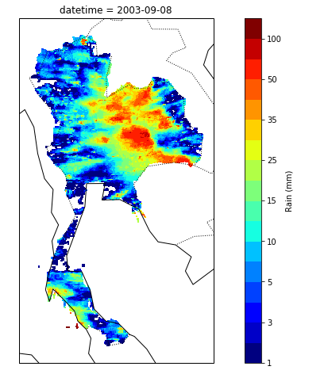

# Thailand rainfall visualization

An example of satellite precipitation data visualization in jupyter notebook (plot_timeseries.ipynb)

#### Run it on Google Colab
From Korakot Chaovavanich:
https://colab.research.google.com/drive/1EgKthEYvBt7UcBCLMRTAcjTSlaautw8h?fbclid=IwAR3mDSFsjupALRFCZdvwmHa6Gi2kZA1nlD2DIh1DGd91ytnEbkY9h_tXrOY#scrollTo=_h4zHzkmPilN

## Data
- PERSIANN-Cloud Classification System (PERSIANN-CCS)
- Data Period Available: January 2003 - Present
- Timesteps: 1, 3, 6 hourly, daily (used in this example)
- Resolutions: 4x4 km
- Source <http://chrsdata.eng.uci.edu/>
- Satellite Precipitation Estimation Methodology <http://chrs.web.uci.edu/SP_activities01.php>
